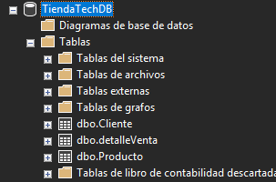
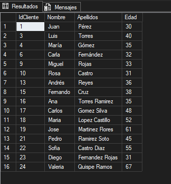
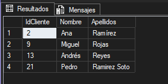
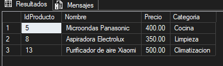

<h2 data-importer="text" align="left">EVIDENCIAS:</h2>

### 

<h3 data-importer="text" align="left">Actividad 1 — Base de Datos</h3>

Evidencia de la creación de la base de datos y sus elementos principales en Microsoft SQL Server.

  

<b>Figura 1.</b> Creación y estructura de la base de datos.

### 

<h3 data-importer="text" align="left">Actividad 2 — Consultas y filtros</h3>

Se muestran evidencias de las consultas realizadas mediante SELECT, WHERE y los filtros solicitados.

  

<b>Figura 2.</b> Consulta utilizando la cláusula WHERE.

  

<b>Figura 3.</b> Consulta utilizando el filtro LIKE.

  

<b>Figura 4.</b> Consulta utilizando el filtro BETWEEN.

  

<b>Figura 5.</b> Consulta utilizando GROUP BY y HAVING.

### 

<h3 data-importer="text" align="left">Actividad 3 — Consultas multitabla</h3>

Las consultas correspondientes a INNER JOIN, OUTER JOIN, CASE y UNION se encuentran desarrolladas en el archivo <b>Actividad 3.sql</b>.

### 

<h3 data-importer="text" align="left">Actividad 4 — Subconsultas y EXISTS</h3>

Las consultas correspondientes a subconsultas y EXISTS se encuentran desarrolladas en el archivo <b>Actividad 4.sql</b>.

